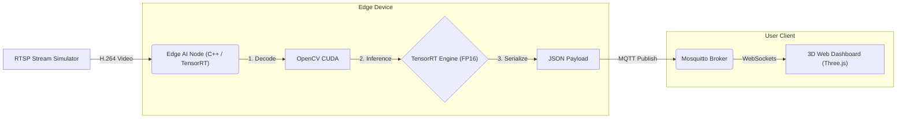

# Edge-to-Cloud 3D Traffic Digital Twin System


> **A high-performance AIoT system that bridges Edge AI and Digital Twins.** > This project processes real-time traffic video streams on the edge using **C++** and **TensorRT**, achieving ultra-low latency inference (120+ FPS), and visualizes the results as a synchronized 3D Digital Twin in the browser via **MQTT**.

---

## 🚀 Key Features

* **Extreme Edge Performance:** optimized YOLOv8n inference pipeline using **C++** and **TensorRT (FP16)**, achieving **120+ FPS** on NVIDIA RTX 3060 Laptop GPU.
* **Microservices Architecture:** Fully containerized system using **Docker**, decoupling the AI Compute Node, Message Broker, and Visualization Service.
* **Real-time Digital Twin:** Interactive 3D visualization built with **Three.js**, synchronized with physical world events via **WebSockets**.
* **Robust Telemetry:** Utilizes **MQTT** for lightweight, decoupled, and reliable data transmission suitable for IoT networks.
* **Dynamic Shape Optimization:** Solved TensorRT dynamic shape compilation challenges to support variable input resolutions.

---

## 🏗️ System Architecture

The system follows a strict **Edge-to-Cloud** data flow pattern:


* **Input Source:** Simulates an IP Camera RTSP stream.

* **Edge AI Node (C++):** Handles hardware-accelerated decoding, TensorRT inference, and data serialization.

* **Message Broker:** Eclipse Mosquitto bridging TCP (for C++) and WebSockets (for Web).

* **Digital Twin Dashboard:** Visualizes the structured data (bounding boxes, classes) in a 3D space.

---

## 🛠️ Tech Stack

|Component|Technology|
|-----|-----|
|Language|"C++17, Python 3.8, JavaScript (ES6)"|
|AI Kernel|"NVIDIA TensorRT 8.6, CUDA 12.x, YOLOv8"|
|Computer Vision|OpenCV 4.5 (C++ API)|
|Infrastructure|"Docker, WSL2 (Ubuntu 22.04)"|
|Communication|"Eclipse Mosquitto (MQTT), Paho MQTT C++"|
|Visualization|Three.js (WebGL)|

---

## ⚡ Quick Start
Prerequisites
* NVIDIA GPU (Compute Capability 7.0+)

* Docker & NVIDIA Container Toolkit

* Linux Environment (Ubuntu 20.04+ or WSL2)

1.Clone the Repository
```Bash!
git clone [https://github.com/mv670810/edge-ai-traffic-twin.git](https://github.com/mv670810/edge-ai-traffic-twin.git)
cd edge-ai-traffic-twin
```

2.Build the AI Environment (Docker)
We use a custom Dockerfile to handle C++ dependencies (OpenCV, Paho MQTT, TensorRT).
```Bash!
docker build -t traffic-cpp-env -f docker/Dockerfile.cpp .
```

3.Build TensorRT Engine
Place your yolov8n.onnx in the data/ folder. Then, compile the engine inside the container:

```Bash!
# Compiles ONNX to TensorRT Engine with FP16 precision and Dynamic Shapes support
docker run --rm --gpus all -v $(pwd):/app -w /app/src traffic-cpp-env \
    /usr/src/tensorrt/bin/trtexec \
    --onnx=/app/data/yolov8n.onnx \
    --saveEngine=/app/data/yolov8n.engine \
    --fp16 \
    --minShapes=images:1x3x640x640 \
    --optShapes=images:1x3x640x640 \
    --maxShapes=images:1x3x640x640
```

4.Launch the System
Step 1: Start MQTT Broker (Supports both TCP and WebSockets)
```Bash!
docker run -d --name mqtt-broker \
  -p 1883:1883 -p 9001:9001 \
  -v $(pwd)/docker/mosquitto/mosquitto.conf:/mosquitto/config/mosquitto.conf \
  eclipse-mosquitto
```

Step 2: Start Video Simulation
```Bash!
source .venv/bin/activate
python3 src/stream_sim.py
```

Step 3: Start AI Inference Node (C++)
```Bash
docker run --rm --gpus all --net=host \
  -v $(pwd):/app -w /app/src \
  traffic-cpp-env \
  bash -c "mkdir -p build && cd build && cmake .. && make && ./traffic_app"
```

Step 4: Start Web Dashboard
```Bash
cd web && python3 -m http.server 8000
```

* Access the dashboard at **http://localhost:8000.**

---

## 📂 Directory Structure
```Plaintext!
├── docker/
│   ├── Dockerfile.cpp        # C++ Development Environment Setup
│   └── mosquitto/            # MQTT Broker Configuration
├── src/
│   ├── main.cpp              # Core AI Logic (C++ & TensorRT)
│   ├── CMakeLists.txt        # Build Configuration
│   └── stream_sim.py         # RTSP Stream Simulator
├── web/
│   └── index.html            # 3D Digital Twin Interface (Three.js)
├── data/
│   └── yolov8n.onnx          # AI Model Source
└── README.md
```
---
## 這是一份經過專業修飾、針對 「AI 架構師 / 全端 AI 工程師」 職位量身打造的 README.md。 這份文件強調了你的 C++ 優化能力、系統設計思維 以及 全端整合經驗。其中包含了一個 Mermaid 架構圖代碼，GitHub 會自動將其渲染成漂亮的流程圖。 請直接複製以下內容到你的 README.md 檔案中：   Markdown    # Edge-to-Cloud 3D Traffic Digital Twin System


> **A high-performance AIoT system that bridges Edge AI and Digital Twins.** > This project processes real-time traffic video streams on the edge using **C++** and **TensorRT**, achieving ultra-low latency inference (120+ FPS), and visualizes the results as a synchronized 3D Digital Twin in the browser via **MQTT**.

---

## 🚀 Key Features

* **Extreme Edge Performance:** optimized YOLOv8n inference pipeline using **C++** and **TensorRT (FP16)**, achieving **120+ FPS** on NVIDIA RTX 3060 Laptop GPU.
* **Microservices Architecture:** Fully containerized system using **Docker**, decoupling the AI Compute Node, Message Broker, and Visualization Service.
* **Real-time Digital Twin:** Interactive 3D visualization built with **Three.js**, synchronized with physical world events via **WebSockets**.
* **Robust Telemetry:** Utilizes **MQTT** for lightweight, decoupled, and reliable data transmission suitable for IoT networks.
* **Dynamic Shape Optimization:** Solved TensorRT dynamic shape compilation challenges to support variable input resolutions.

---

## 🏗️ System Architecture

The system follows a strict **Edge-to-Cloud** data flow pattern:

```mermaid
graph LR
    source[RTSP Stream Simulator] -->|H.264 Video| ai_node(Edge AI Node<br/>C++ / TensorRT)
    
    subgraph Edge Device
        ai_node -->|1. Decode & Resize| opencv[OpenCV CUDA]
        opencv -->|2. Inference| trt{TensorRT Engine<br/>FP16}
        trt -->|3. NMS & Serialize| json[JSON Payload]
    end

    json -->|MQTT Publish| broker(Mosquitto Broker)
    
    subgraph User Client
        broker -->|WebSockets| dashboard[3D Web Dashboard<br/>Three.js]
    end
  1.  Input Source: Simulates an IP Camera RTSP stream.  2.  Edge AI Node (C++): Handles hardware-accelerated decoding, TensorRT inference, and data serialization.  3.  Message Broker: Eclipse Mosquitto bridging TCP (for C++) and WebSockets (for Web).  4.  Digital Twin Dashboard: Visualizes the structured data (bounding boxes, classes) in a 3D space.     🛠️ Tech Stack Component Technology   Language C++17, Python 3.8, JavaScript (ES6)  AI Kernel NVIDIA TensorRT 8.6, CUDA 12.x, YOLOv8  Computer Vision OpenCV 4.5 (C++ API)  Infrastructure Docker, WSL2 (Ubuntu 22.04)  Communication Eclipse Mosquitto (MQTT), Paho MQTT C++  Visualization Three.js (WebGL)   匯出到試算表     ⚡ Quick Start Prerequisites •  NVIDIA GPU (Compute Capability 7.0+)  •  Docker & NVIDIA Container Toolkit  •  Linux Environment (Ubuntu 20.04+ or WSL2)   1. Clone the Repository Bash    git clone [https://github.com/mv670810/edge-ai-traffic-twin.git](https://github.com/mv670810/edge-ai-traffic-twin.git)
cd edge-ai-traffic-twin
  2. Build the AI Environment (Docker) We use a custom Dockerfile to handle C++ dependencies (OpenCV, Paho MQTT, TensorRT). Bash    docker build -t traffic-cpp-env -f docker/Dockerfile.cpp .
  3. Build TensorRT Engine Place your yolov8n.onnx in the data/ folder. Then, compile the engine inside the container: Bash    # Compiles ONNX to TensorRT Engine with FP16 precision and Dynamic Shapes support
docker run --rm --gpus all -v $(pwd):/app -w /app/src traffic-cpp-env \
    /usr/src/tensorrt/bin/trtexec \
    --onnx=/app/data/yolov8n.onnx \
    --saveEngine=/app/data/yolov8n.engine \
    --fp16 \
    --minShapes=images:1x3x640x640 \
    --optShapes=images:1x3x640x640 \
    --maxShapes=images:1x3x640x640
  4. Launch the System Step 1: Start MQTT Broker (Supports both TCP and WebSockets) Bash    docker run -d --name mqtt-broker \
  -p 1883:1883 -p 9001:9001 \
  -v $(pwd)/docker/mosquitto/mosquitto.conf:/mosquitto/config/mosquitto.conf \
  eclipse-mosquitto
  Step 2: Start Video Simulation Bash    source .venv/bin/activate
python3 src/stream_sim.py
  Step 3: Start AI Inference Node (C++) Bash    docker run --rm --gpus all --net=host \
  -v $(pwd):/app -w /app/src \
  traffic-cpp-env \
  bash -c "mkdir -p build && cd build && cmake .. && make && ./traffic_app"
  Step 4: Start Web Dashboard Bash    cd web && python3 -m http.server 8000
  Access the dashboard at http://localhost:8000.

---

## 📂 Directory Structure Plaintext    ├── docker/
│   ├── Dockerfile.cpp        # C++ Development Environment Setup
│   └── mosquitto/            # MQTT Broker Configuration
├── src/
│   ├── main.cpp              # Core AI Logic (C++ & TensorRT)
│   ├── CMakeLists.txt        # Build Configuration
│   └── stream_sim.py         # RTSP Stream Simulator
├── web/
│   └── index.html            # 3D Digital Twin Interface (Three.js)
├── data/
│   └── yolov8n.onnx          # AI Model Source
└── README.md

---

## 🎥 Demo
https://youtu.be/NaJ5JHa8c8Q

---

## Hackmd
https://hackmd.io/@mv67081077/SJaTOhQGbx

---

## 📄 License
Distributed under the MIT License.


